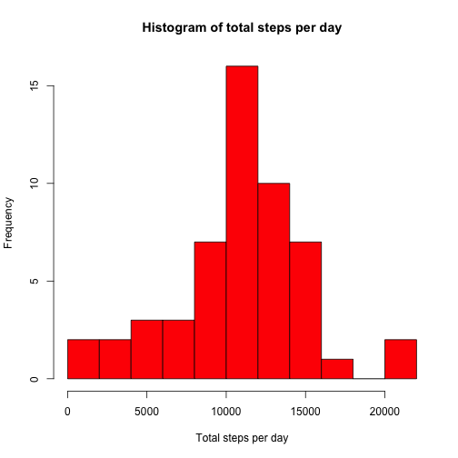
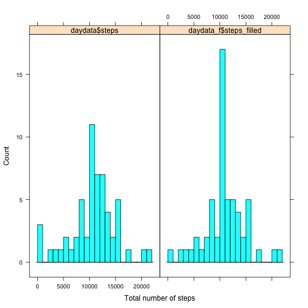

# Reproducible Research: Peer Assessment 1


## Loading and preprocessing the data

```r
data <- read.csv("activity.csv")
```
Let us add a datetime field combining date and time for further processing if required.

```r
data$datetime <- strptime(paste(data$date, sprintf("%04d", data$interval)), format="%Y-%m-%d %H%M")
```

## What is mean total number of steps taken per day?

We can use the aggregate function to sum all activity on a particular day.

```r
daydata <- aggregate(steps ~ date, data = data, FUN = sum)
```
Now we can plot the histogram on the number of steps per day

```r
hist(daydata$steps, breaks=10, col="red", main="Histogram of total steps per day", xlab="Total steps per day")
```

 

To get the mean and median number for steps, we do

```r
mean(daydata$steps)
```

```
## [1] 10766
```

```r
median(daydata$steps)
```

```
## [1] 10765
```
From here, we see that the mean number of steps per day is 1.0766 &times; 10<sup>4</sup> and median is 10765.

## What is the average daily activity pattern?

To get the average daily activity patter, we need to aggegate by the interval using the mean function.

```r
intervaldata <- aggregate(steps ~ interval, data = data, FUN = mean)
```
We can plot this as a timeseries

```r
library(lattice)
xyplot(steps ~ interval, data=intervaldata, type='l')
```

 

The interval having maximum number of steps is 

```r
intervaldata[which.max(intervaldata$steps), ]
```

```
##     interval steps
## 104      835 206.2
```

## Imputing missing values
Total number of missing values for each column can be found by

```r
sapply(data, function(x) sum(is.na(x)))
```

```
##    steps     date interval datetime 
##     2304        0        0        0
```
So we find that only steps column has missing values. Let us replace those missing values using the mean of that 5-minute interval that we calculated earlier.

```r
f <- function(steps, interval) {
  if (is.na(steps)) intervaldata[intervaldata$interval==interval, ]$steps
  else steps
}
data$steps_filled = mapply(f, data$steps, data$interval)
daydata_f <- aggregate(steps_filled ~ date, data = data, FUN = sum)
```
Again, we can plot the histogram on the number of steps per day

```r
hist(daydata_f$steps_filled, breaks=10, col="red", main="Histogram of total steps per day", xlab="Total steps per day")
```

 

To get the mean and median number for steps, we do

```r
mean(daydata_f$steps_filled)
```

```
## [1] 10766
```

```r
median(daydata_f$steps_filled)
```

```
## [1] 10766
```
From here, we see that the mean number of steps per day is 1.0766 &times; 10<sup>4</sup> and median is 1.0766 &times; 10<sup>4</sup>. We see that the mean has remain unchanged but the median value has increased slightly. But more than that, the histogram shows that the total number of steps has increased overall for some days. We can see that via the following comparison of histograms.


```r
histogram(~ daydata$steps +daydata_f$steps_filled, type="count", 
          breaks=20, layout=c(2,1), xlab="Total number of steps")
```

 

## Are there differences in activity patterns between weekdays and weekends?
Now we will analyze the difference in activity between weekday and weekends. We will use the filled data for this. Lets add a factor variable for weekdays (Monday to Friday) and weekend (Saturday and Sunday) using the weekdays function.

```r
levels <- c("Monday", "Tuesday", "Wednesday", "Thursday", "Friday", "Saturday", "Sunday")
data$day <- factor(weekdays(data$datetime), levels)

labels <- c("Weekday", "Weekday", "Weekday", "Weekday", "Weekday", "Weekend", "Weekend")
levels(data$day) <- labels

intervaldata <- aggregate(steps_filled ~ interval+day, data = data, FUN = mean)

xyplot(steps_filled ~ interval|day, data=intervaldata, ylab="Number of steps", type='l', layout=c(1,2))
```

 

A visual overview shows reduced activity in the daytime for the weekdays as compared to weekends.
